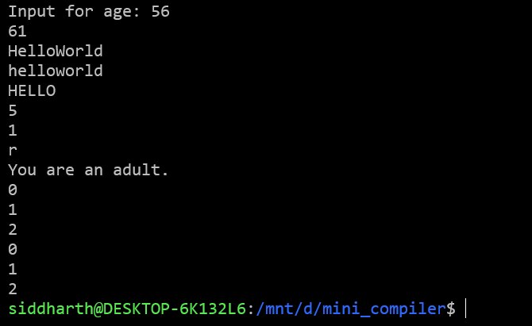
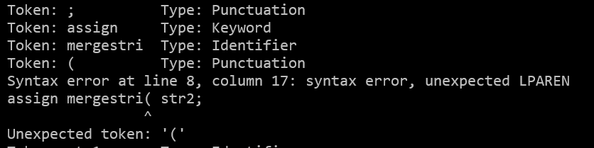

# 📝 Scriptura Language

Scriptura is a **lightweight, beginner-friendly programming language** designed with simplicity and readability in mind.  
It provides familiar syntax while remaining expressive enough for everyday programming tasks like math, string handling, and control flow.

---

## 🚀 Features

### 🔹 Variables & Assignment
```scriptura
input age;
assign age plus 5 to newAge;
print(newAge);   // Prints age + 5
```
### 🔹 Strings & Operations
```
assign "Hello" to str1;
assign "World" to str2;

assign mergestring(str1, str2) to mergedStr;   // "HelloWorld"
assign tolowercase(mergedStr) to lowerStr;     // "helloworld"
assign touppercase(str1) to upperStr;          // "HELLO"
assign stringlength(str1) to len1;             // 5
assign indexof(str1, "e") to idx;              // 1
assign characterat(str2, 2) to charAtPos;      // "r"

print(mergedStr);
print(lowerStr);
print(upperStr);
print(len1);
print(idx);
print(charAtPos);
```
### 🔹 Conditionals
```
if (age greater than 18) {
    print("You are an adult.");
} else {
    print("You are not an adult.");
}
```
### 🔹 Loops
```
assign 0 to i;
while (i less than 3) {
    print(i);
    assign i plus 1 to i;
}

for (assign 0 to j; j less than 3; assign j plus 1 to j) {
    print(j);
}
```
### 🔹 Math Operations
```
assign 10 plus 5 to sum;     
assign 10 minus 3 to diff;  
assign 4 times 2 to prod;    
assign 9 divide 2 to quot;      
assign 9 mod 2 to rem;       
```
| Keyword / Operator              | Meaning                     | Example                                                            |
| ------------------------------- | --------------------------- | ------------------------------------------------------------------ |
| `input x;`                      | Read user input             | `input age;`                                                       |
| `assign ... to ...;`            | Assign value to variable    | `assign 5 to x;`                                                   |
| `print(expr);`                  | Print expression            | `print(x);`                                                        |
| `plus, minus, times, div, mod`  | Math operations             | `assign 10 plus 2 to y;`                                           |
| `mergestring(a, b)`             | Concatenate strings         | `assign mergestring("Hi", "There") to msg;`                        |
| `tolowercase(x)`                | Convert string to lowercase | `assign tolowercase("HELLO") to res;`                              |
| `touppercase(x)`                | Convert string to uppercase | `assign touppercase("hello") to res;`                              |
| `stringlength(x)`               | Length of string            | `assign stringlength("Hello") to len;`                             |
| `indexof(s, sub)`               | Index of substring          | `assign indexof("Hello", "e") to idx;`                             |
| `characterat(s, n)`             | Character at position       | `assign characterat("World", 2) to ch;`                            |
| `if (...) { ... } else { ... }` | Conditional                 | `if (x greater than 5) { ... } else { ... }`                       |
| `while (...) { ... }`           | While loop                  | `while (i less than 5) { ... }`                                    |
| `for(init; cond; step) { ... }` | For loop                    | `for (assign 0 to i; i less than 5; assign i plus 1 to i) { ... }` |

> [!NOTE]
>we have also printed the lexical analysis part of the tokens

### Prerequisites
Before you start, make sure you have the following installed:

- **GNU Bison** (for parsing)
- **Flex** (for lexical analysis)
- **G++** (for compiling)
- **Make** (for building the project)

### Install on Ubuntu/Debian:
```
sudo apt-get install bison flex g++ make
```

### For running it:
```
./mini_compiler input.txt
```
🔮 Roadmap

✅ String handling functions

✅ For/While loops

✅ If/Else branching

🔲 Functions and user-defined methods

🔲 Arrays and collections

### ScreenShots





